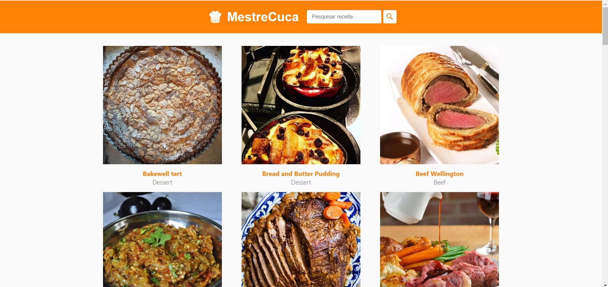
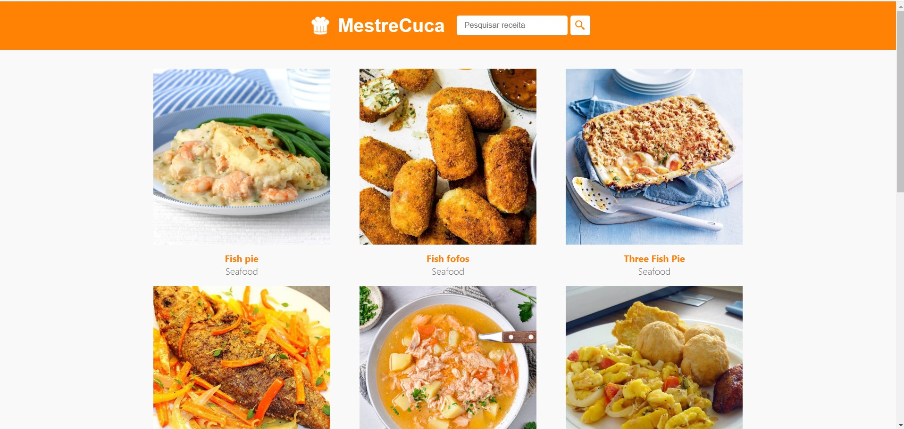
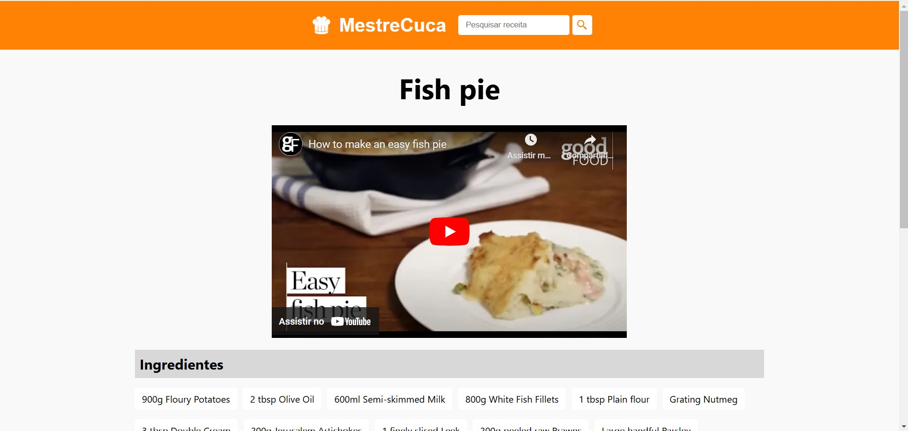
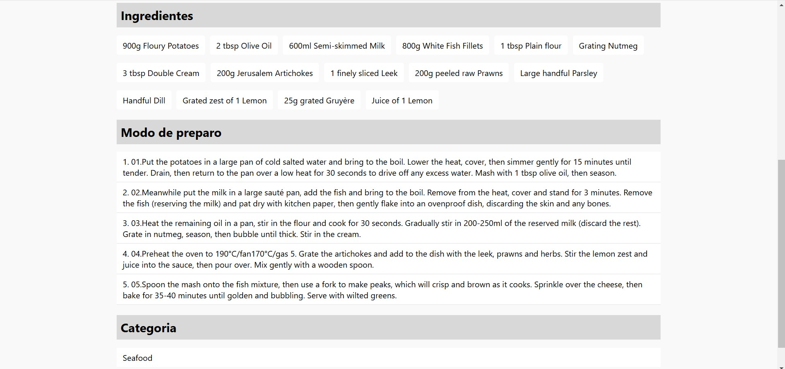

# MestreCuca

A recipe website built with React.js and TheMealDB API.

## Table of Contents

- [About](#about)
- [Features](#features)
- [Technologies](#technologies)
- [Screenshots](#screenshots)
- [Installation](#installation)
- [Usage](#usage)
- [Contact](#contact)

## About

MestreCuca is a recipe website that allows users to browse and search for recipes, view video tutorials, and read recipes and ingredients in text format.

## Features

- Display a list of recipes
- Search for recipes
- View video tutorials for recipes
- Read recipes and ingredients in text format

## Technologies

- React.js
- HTML
- CSS
- JavaScript
- Axios
- TheMealDB API

## Screenshots

Here are some screenshots of the application:

- Home
  
- Fish Recipes
  
- Recipe Example 1
  
- Recipe Example 2
  

## Installation

To run this project, follow these steps:

1. Clone the repository:
    ```bash
    git clone https://github.com/yourusername/mestrecuca.git
    ```

2. Navigate to the project directory:
    ```bash
    cd mestrecuca
    ```

3. Install the dependencies:
    ```bash
    npm install
    ```

4. Create a `.env` file in the root directory and add your TheMealDB API base url:
    ```env
   REACT_APP_BASE_URL=https://www.themealdb.com/api/json/v1/1/
    ```

5. Start the development server:
    ```bash
    npm start
    ```

## Usage

Once the server is running, open your browser and navigate to `http://localhost:3000` to view the recipe website. Use the search bar to find recipes, and click on a recipe to view the details, including video tutorials and ingredients.


